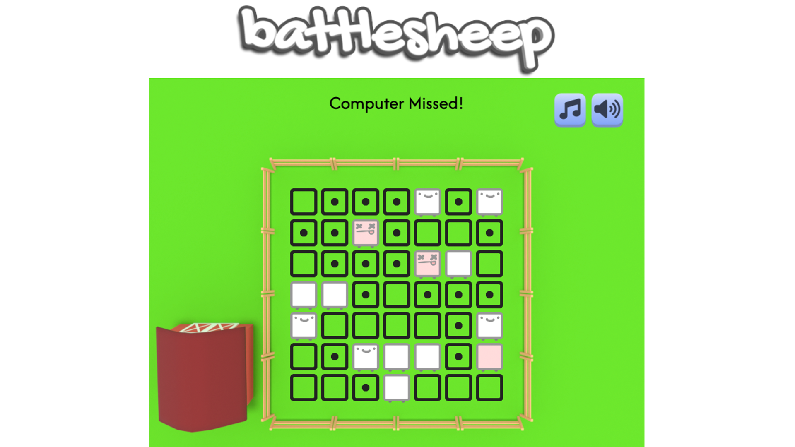
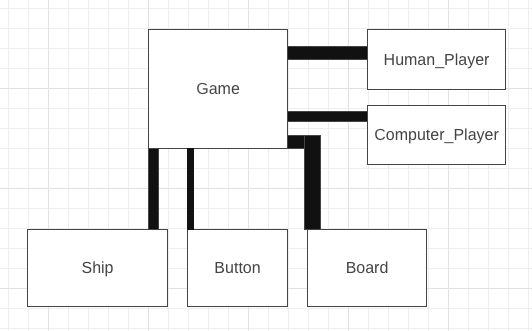

# BATTLESHEEP

[Battlesheep](https://ncioffi1.github.io/Battlesheep/) is a spin on the game Battleship.  Two enemy farmers take turns trying to fire a cannon at each others' sheep.  In this game, both players have a selection of sheep depending on the size
of the board.  Sheeps can have different shapes - some sheeps are straight lines, while others bend and twist into different block shaped pieces.  Once the player has set their sheep, the game loop begins, and players take turns firing at the enemy's squares until one player no longer has any sheep left.  The player with sheep remaining at the end of the game is the winner.


# Wireframe:



## Functionality and MVPs:

### In this game, users are able to:

* Choose between two different board sizes, 7x7 and 9x9.  Switching between these board sizes prompts a complete instantaneous rebuild of the game board and pieces.
* Toggle Sound and Music on and off.
* Play a game to completion, upon which they can play again if they like.

## Technologies, Libraries, APIs

This project is implemented with the following technologies:
* Canvas API to render the game board
* Webpack to bundle and transpile the source JavaScript code
* NPM to manage project dependencies
* Febucci's Easing Functions:  https://www.febucci.com/2018/08/easing-functions/

### Placing Sheep

Figuring out the logic for placing sheep on the game board proved to be quite
a challenge.

Essentially, I came to two options:
1.  Generate every possible position on the board, and pick one randomly.
2.  Pick a random position for each sheep - if your picks aren't possible, start over and try again.

When I explored option 1, I found that iterating through every possible permutation
of a game board was a complete performance nightmare.  Turns out, if you have
a board that's 7x7 (49 possible squares to place), with a game of 6 pieces,
that's 49^6, which comes out to >1 billion options for the computer to sift through...  Oof.  And this isn't even including possible rotations into the mix.

So, I went through option 2.  When I did so, I found that at worst, the amount
of rerolls the program had to do was in the single digits, which is essentially
instantaneous to an end user.  The math for a reroll & probability of failure
looks something like this:

%chance_success = (possible_solutions / possible_permutations) * 100

%chance_failure = (possible_failures / possible_permutations) * 100

Long story short, for each successive roll, there's always the same % chance that
the program will land on a possible solution.  In a game with over a billion options, with most of them being possible solutions, this works out OK. 

The following code block iterates through already placed sheep positions
and marks them as invalid.  It then iterates through the entire board -
at each square of the board, if it is possible to place every part of a sheep,
that sheep position is added to the possible position array.

```js
generatePossiblePositionArray(playerType, mySheep, myInvalidPositions) {
        let positions = []
        let that = this;
        if (myInvalidPositions === undefined){
            if (playerType === "player") {
                myInvalidPositions = this.sheepPositions;
            } else {
                myInvalidPositions = this.enemySheepPositions;
            }
        }
        if (mySheep === undefined){
            mySheep = this.activeSheep;
        }

        for (let i = 0; i < this.boardSize; i++) {
            for (let j = 0; j < this.boardSize; j++) {
                let valid = true;
                mySheep.sheepShapes.forEach(function(shape) {
                    let _x = i + shape[0];
                    let _y = j + shape[1];
                    let _pos = [_x, _y];
                    if (!that.validSpotToPlace(playerType, _pos, myInvalidPositions)) {
                        valid = false;
                    }
                   
                })
                if (valid){
                    positions.push([i, j]);
                }
            }
        }
        return positions;
    }
```

### Reading Possible Positions

When spawning sheep - for the player, or the enemy - the generatePossiblePositions function is used to give the computer a list of valid options to choose from.  This is nested in a while loop.  The computer will try to place every possible sheep that it has to, randomly, with a random rotation.  If the computer fails, it clears out all the sheep it placed, and it tries again - it does this until it succeeds.

Once the computer succeeds, it breaks out of the while loop, and the selected player now has an array of successfully placed sheeps with valid positions on the game board.

```js
spawnSheep(playerType){
    let that = this;

    this.generateRotations();

    let l = 0;
    let myLeftToPlace = [];
    if (playerType === "player"){
        l = this.sheepLeftToPlace.length;
        myLeftToPlace = JSON.parse(JSON.stringify(this.sheepLeftToPlace));
    } else if (playerType === "enemy") {
        l = this.computerLeftToPlace.length;
        myLeftToPlace = JSON.parse(JSON.stringify(this.computerLeftToPlace));
    }
    let placingComplete = false;
    let iterations = 0;
    let q = 0;

    while (!placingComplete) {
        placingComplete = true;

        if (q < l) {
            this.activeSheep = this.generateActiveSheep(myLeftToPlace[q], this.sheepRotations[q]);
            
            let positions = this.generatePossiblePositionArray(playerType);
            if (positions.length === 0) {  // if theres no possible positions,
                iterations += 1;
                q = 0;
                this.clearSheep(playerType);
            } else {
                let random = Math.floor(Math.random() * positions.length);  // pick a random one.
                let random_pos = positions[random];
                if (playerType === "player"){
                    this.playerSheeps.push(this.activeSheep);
                    this.activeSheep.placeSheep("player", random_pos);
                } else if (playerType === "enemy"){
                    this.enemySheeps.push(this.activeSheep);   // add the sheep to the enemy sheeps list.
                    this.activeSheep.placeSheep("enemy", random_pos);  // add the positions of the sheep to enemySheepPositions.
                }
                q += 1;
            }
            placingComplete = false;
        } else {
            placingComplete = true;
        }
    }
}
```


## Future Implementations (Optional):
* Add ability for players to move their own sheep before starting the game.
* Add ability for allow players to rotate their sheep before starting the game.
* Add difficulty levels for computer.
* Add a tracker for 'games won' with localstorage.

## CC Licensing:

See 'credits' section in game for CC licensing.

## Implementation Timeline

* Friday Afternoon & Weekend:
Setup project.
Get webpack up and running.
Get canvas to show up.
Get comfortable with Canvas API.
Design game assets.  Sheep,
background picture, cannon,
farmer, etc.
Get game assets to show up on screen.
Get the scaling, positioning, and rotation of objects right.  
Be able to manipulate these objects through player input if necessary (rotation, particularly, for rotating sheep blocks during place sheeps phase).
Outline, in code, the different game phases (from player 1's perspective, as that's what's in scope):
* main menu phase
* options phase 
* place sheep phase
* player 1 turn (player 2's squares, masked by fog of war)
* player 2 turn (attacks player 1's squares, player can see their own ships.)
* you win! / lose! end phase

* Monday
Finalize the game logic.
Implement the Computer AI.
Make it so that the computer, on every turn, hits a random position on the board.

* Tuesday
Add sounds.
Add music.
Code ability to turn music on and off.
Code ability to turn sound effects on and off.

* Wednesday
Finish implementing controls.
Test for bugs // edge cases.
Ensure things are rendering correctly.
Ensure gameplay works as expected.

* Thursday
Deploy to github pages.
Write a production README.

BONUS:
When making a new game, make the following fields customizable
* Board size (always a square.  7x7, 9x9, 11x11)
* Amount of Ships (1x1, 2x1, 3x1, 4x1, 2x2)
* Difficulty of Computer (Easy, Medium, Hard)
    * EASY: computer fires randomly every time.
    * MEDIUM: computer on a hit searches for the hit ship.
    * HARD: computer operates on a diagonal AND searches for hit ship on hit.


